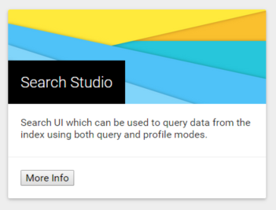
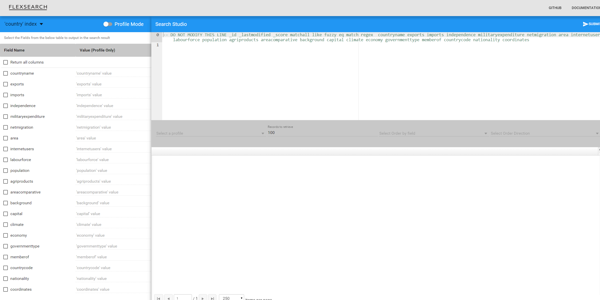

# Searching using the UI
## Search basics
FlexSearch utilizes custom query format inspired by SQL. This is done to reduce
the learning curve when moving to FlexSearch as most of the modern day
programmers have written SQL at some point of time in there life.

This syntax is not difficult to pick up even if you don't know SQL. A search query
consists of a group of conditions. Each condition is logically related to other
condition in the group using and/or operator. Each condition contains a predicate
which is evaluated by the engine to see if the condition is true or not. A
predicate follows a simple structure of:

```
<predicate> ::= <field name> <operator> <values>
```

Field name: the name of the field which is to be searched.
Operator: the operator to be used against the field for example equal to, greater
than, less than etc.
Values: a set of values or a single value which is to be used to evaluate the predicate.

For example, if you want to search for first name equal to John in a contact
index then the search predicate would be:

```
firstname eq 'John'
```

Values in FlexSearch are always enclosed in `'`. One can also pass a set of values
for searching. For example if we wanted to search for a first name from a list of
names then we could have modified the above expression to:

```
firstname eq ['John', 'Tom']
```

the above is a short form for writing two conditions. We could have broken the
above condition into two sub-conditions and joined them by an AND clause.
```
firstname eq 'John' AND firstname eq 'Tom'
```
The above examples demonstrate one of the search operator supported by FlexSearch.
Out-of-the-box FlexSearch supports a wide variety of operators which can be used
in different kind of situations. Follow along the tutorial to uncover many such
operators.

## Accessing the search UI
FlexSearch exposes REST services for all its search operations. In order to
reduce the learning curve FlexSearch comes with an easy to use search interface.
This interface can be used to try out all the different operators supported by
the engine and to also explore the data present an index. Needless to say any
functionality available through the UI can also be accessed using the rest web
service.

The search UI also called 'Search Studio 'can be accessed from the home page of
the portal. Go to the homepage and select the search studio card.



Inside the Search Studio, click on the index drop-down and choose country index.
This is the index that was created in the previous tutorial.



On the left-hand side you can see all the fields that are present in the index.
On the top right hand side you have a button to submit the search. You can enter
your search query in the main query input box.

Let's explore some of the FlexSearch's query operators. The below links point to
the search DSL help pages. You don't have to read the whole page but can simply
read the top explanation and go through few examples. A lot of examples are
provided on the pages to illustrate the finer details of using an operator.
