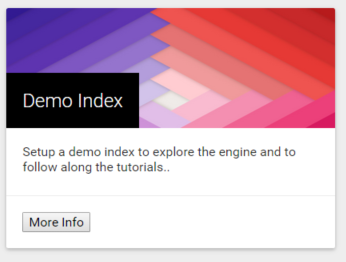

# Setting up demo index

FlexSearch ships sample data extracted from ``World Fact book`` which is used to
create a dummy index. This will be used throughout the documentation to explain
major concepts. You can download the data from the following link to cross check
the results: [World Fact Book](/docs/resources/demo.json).

This data is extremely useful for demonstrating a number of search concepts. There
are various kinds of fields which can be used for text and numeric searching.

The data presented here is for demonstration purpose only and may not be relevant
in real world.

In order to set up demo index, good to the homepage of the portal and select the
demo index card from the installed tools section.

## A quick side tour of the terminology
Before we start exploring the details of the engine, it would be a good idea to
understand the basic terminology involved. In order to keep the concept easy to
grasp we will try to compare FlexSearch's indexes to modern-day databases. This
comparison doesn't imply that FlexSearch is a database replacement but is only
done to help the reader better understand the concept. Also, conceptually
databases use an altogether different technique to represent data.

Index and Document
In FlexSearch a document represents the basic unit of information which can be
added or retrieved from the index. A document consists of several fields. A field
represents the actual data to be indexed. In database analogy an index can be
considered as a table while a document is a row of that table. Like a table a
FlexSearch document requires a fix schema and all fields should have a field type.

Analyzer
An analyzer is used at both index time and search time to break the text input
into tokens. These tokens are then passed to a series of filters are which can
do a wide range of processing on them. For example a lowercase filter can convert
the input token into lowercase, a stop word filter can remove preconfigured stop
words from the input text. One can use analyzers to do wide range of text processing.

There are a number of other concepts which are helpful to a user, but the above
is a good starting point. We will uncover other advance concepts as you follow
along the tutorial.

## Columns Used
Below is a quick explanation of the fields used and if we are performing any
special analysis over them.

The below information should be used in context with the search examples to
understand the impact of analyzers or scripts on a field.

<table class="bordered table">
	<thead>
		<tr>
			<th>
Field Name
</th>
			<th>
Index Analyzer
</th>
			<th>
Field Type
</th>
			<th>
Script Name
</th>
		</tr>
	</thead>
	<tbody>
		<tr>
			<td>
`{{FieldName}}`
</td>
			<td>
{{IndexAnalyzer}}
</td>
			<td>
{{FieldType}}
</td>
			<td>
{{ScriptName}}
</td>
		</tr>
	</tbody>
</table>
